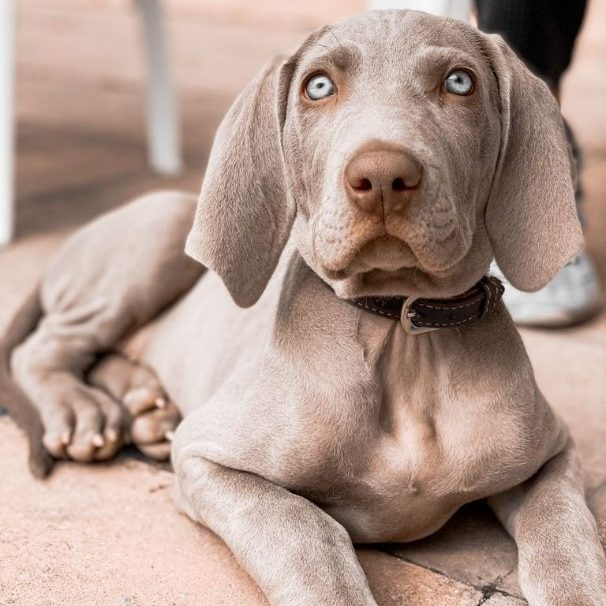

# Titulo
##### subtitulo

Esto es un párrafo y esto 
**esta en negrita** 
*esto en cursiva* 
```esto en codigo``` .
```esto es un trozo de codigo```
1. primero
2. segundo
3. tercero

-leche
-huevos
-cereales
	-multicolor
	-chocolate
	-sin azucar

[aules](https://portal.edu.gva.es/aules/es/inicio/)
[enlace a otro fichero](README.md)




| Mes | Banner |
| Julio | Aniversario |
| Septiembre | WWC |
